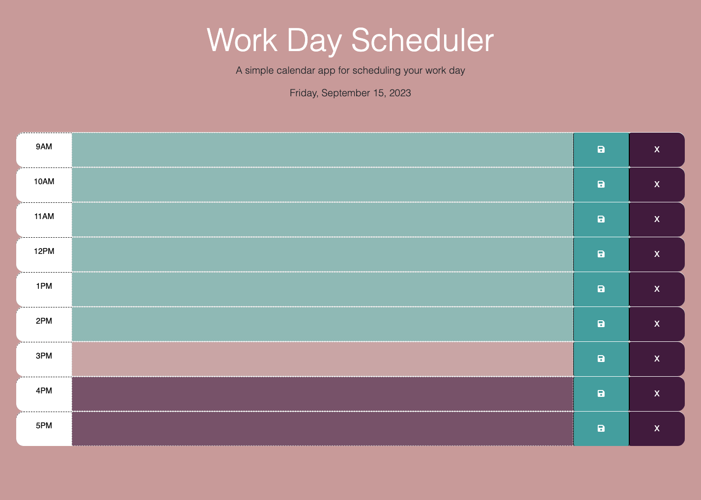
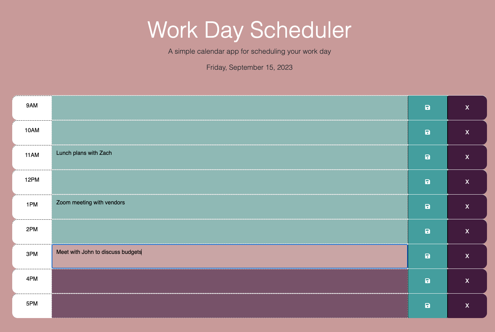

# Work Day Scheduler

[Link to live deploy](https://ltrokey.github.io/work_day_scheduler/)

## Description

As developer, my project revolves around crafting a straightforward yet highly effective Event Scheduler Application, designed to address the daily scheduling needs of users. Motivated by the desire to provide a clear and intuitive tool for managing daily events, I harnessed the capabilities of JavaScript, jQuery, and Bootstrap. A notable challenge was seamlessly incorporating date and time functionality, which I conquered through the implementation of Day.js. This library enabled precise scheduling and ensured a user-friendly experience, empowering individuals to effortlessly organize their daily lives.

## Installation

1. In terminal, CD into project directory.
2. Git clone work_day_scheduler.
3. CD into new project directory.
4. Open with your text editor, for VS Code, command `code .`.

## Usage

#### To Add an Event:

1. Open the Application - Launch the web application in your web browser.
2. At Event Time - Find the text area or input field that corresponds to the time you want to schedule your event. `Click` on this area.
3. Add Event Description - Once the event time is selected, type a brief event description into the text area.
4. Save the Event - After entering the event description, locate and `click` the `Save` button represented by a diskette icon.
5. Confirmation Alert - If your event is successfully saved, an alert will appear on the screen under the date confirming the operation. You'll see a message "Event successfully saved".

#### To Cancel an Event:

1. Locate the Event - Find the event that you want to cancel in the application's interface.
2. `Click` Clear Button: Next to the event you want to delete, there should be a "Clear" button labeled `X`, and `Click`` this button.
3. Confirmation Prompt - A confirmation prompt will appear to ensure you want to delete the event.
4. Confirm Deletion - `Click` `OK` in the confirmation prompt to confirm that you want to delete the event.
5. Confirmation Alert - After confirming the deletion, you'll receive an alert confirming the successful removal of the event under the date.

## License

MIT License

Copyright (c) 2023 ltrokey

Permission is hereby granted, free of charge, to any person obtaining a copy
of this software and associated documentation files (the "Software"), to deal
in the Software without restriction, including without limitation the rights
to use, copy, modify, merge, publish, distribute, sublicense, and/or sell
copies of the Software, and to permit persons to whom the Software is
furnished to do so, subject to the following conditions:

The above copyright notice and this permission notice shall be included in all
copies or substantial portions of the Software.

THE SOFTWARE IS PROVIDED "AS IS", WITHOUT WARRANTY OF ANY KIND, EXPRESS OR
IMPLIED, INCLUDING BUT NOT LIMITED TO THE WARRANTIES OF MERCHANTABILITY,
FITNESS FOR A PARTICULAR PURPOSE AND NONINFRINGEMENT. IN NO EVENT SHALL THE
AUTHORS OR COPYRIGHT HOLDERS BE LIABLE FOR ANY CLAIM, DAMAGES OR OTHER
LIABILITY, WHETHER IN AN ACTION OF CONTRACT, TORT OR OTHERWISE, ARISING FROM,
OUT OF OR IN CONNECTION WITH THE SOFTWARE OR THE USE OR OTHER DEALINGS IN THE
SOFTWARE.

## Badges

  

## Features

The web application is built using a powerful combination of technologies: Day.js for efficient date and time manipulation, jQuery for enhanced interactivity, and Bootstrap for a sleek and responsive user interface. Users can easily manage their events with the following key features:

#### Event Management:

Users can effortlessly add, edit, and delete events, thanks to the intuitive design and interactions provided by jQuery and Bootstrap components.

#### Date and Time Handling:
Day.js ensures precise handling of dates and times, enabling users to set event schedules with ease and accuracy.

#### Save Events:
Users can save their events with a single click. When saving, an alert will confirm the successful save operation, providing immediate feedback.

#### Clear Events:
Clearing events is just as simple as saving them. A dedicated function allows users to quickly remove events from their schedule. An alert notifies users of the successful clearing operation.

#### Error Handling:
To prevent unintended actions, an error alert is displayed if users attempt to save an event with an empty event space. This helps maintain data integrity and ensures that users provide necessary information before saving an event.

